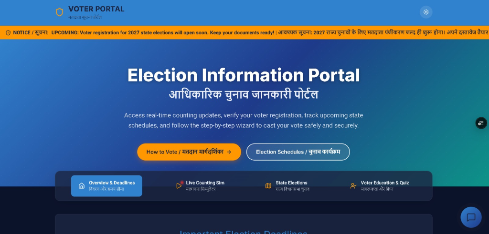
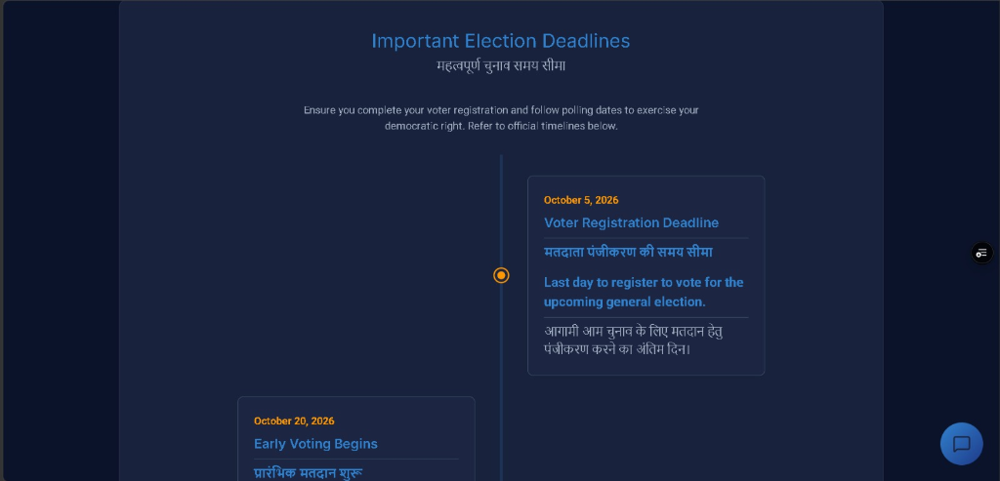
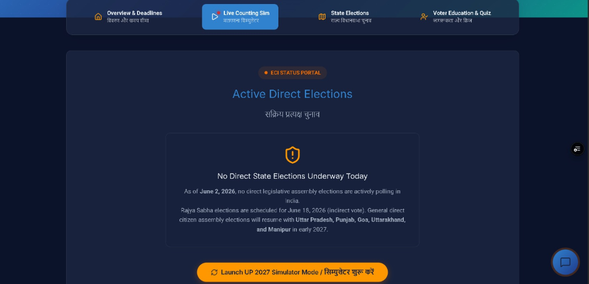
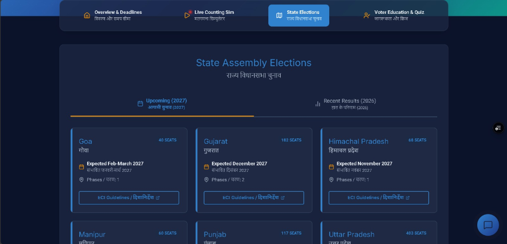
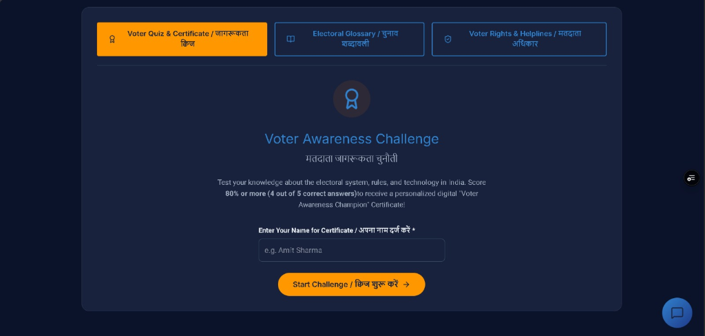

# 🗳️ Official Election Information & Voter Awareness Portal
### आधिकारिक चुनाव जानकारी और मतदाता जागरूकता पोर्टल

An interactive, responsive, and bilingual (English & Hindi) web portal designed to educate citizens about the democratic process, provide real-time updates on upcoming and completed state assembly elections, and assist voters via an AI-powered chat assistant.

🔗 **Development GitHub Repository:** [Jayesh45-master/Voting-Information](https://github.com/Jayesh45-master/Voting-Information)  
🚀 **Live Production Deployment:** [https://voting-information.vercel.app/](https://voting-information.vercel.app/)

---

## 📸 Portal Showcase

### 1. Hero & Navigation
A modern, dark-themed, glassmorphic layout highlighting key action items and primary site sections.


### 2. Important Election Deadlines Timeline
An interactive vertical timeline showing chronological milestones, voter registration dates, and upcoming schedules.


### 3. Live Counting & Results Simulator
An interactive simulator displaying current Direct Elections and allowing users to simulate live vote counting.


### 4. State Assembly Elections Dashboard
A dashboard organizing Upcoming (2027) assembly elections and Recent (2026) election results by state, linked to official ECI guidelines.


### 5. Voter Awareness Challenge & Vintage Certificate
An interactive 5-question bilingual quiz. Scoring 80% or higher generates a customized, printable certificate in a classic antique/vintage style with a custom Ashoka Chakra watermark.


---

## 🚀 Key Features

*   **🤖 AI Voter Assistant (Chatbot):** Powered by the Google Gemini API to answer any questions about voter registration, documentation, EPIC cards, or the voting process.
*   **🏆 Voter Awareness Quiz:** Tests knowledge about the Indian electoral system and generates a premium printable digital certificate for champions.
*   **📚 Bilingual Electoral Glossary:** Quick search and filter tool for electoral terms in both English and Hindi.
*   **📊 State Elections Tracker:** Shows seat breakdowns, candidate timelines, and historical assembly results.
*   **📈 Google Analytics 4 (GA4):** Fully integrated traffic analysis with custom event logging ( chatbot queries, quiz attempts, state schedule checks, and certificate downloads).
*   **📱 Mobile Optimized:** Native-feeling mobile adaptations with horizontal scroll menus, vertical timelines, and fluid spacing.

---

## 🛠️ Technology Stack

*   **Framework:** Next.js (App Router)
*   **Language:** TypeScript & JavaScript
*   **Styling:** Vanilla CSS (Glassmorphism design tokens)
*   **Icons:** Lucide React
*   **Database:** MongoDB via Mongoose ODM
*   **AI Integration:** Google Gemini API (`@google/generative-ai`)
*   **Analytics:** Google Analytics 4 (`gtag.js`)

---

## ⚙️ Getting Started & Installation

### Prerequisites
*   [Node.js](https://nodejs.org/) (v18.0.0 or higher recommended)
*   [MongoDB](https://www.mongodb.com/) (Must be installed locally or set up via MongoDB Atlas)
    *   **Local Setup:** Install [MongoDB Community Server](https://www.mongodb.com/try/download/community) and ensure it is running on port `27017` (default).
    *   **Cloud Setup:** Register for a free database on [MongoDB Atlas](https://www.mongodb.com/cloud/atlas) and copy the application connection string.

### 1. Clone the Repository
```bash
git clone https://github.com/Jayesh45-master/Voting-Information.git
cd Voting-Information
```

### 2. Install Dependencies
```bash
npm install
```

### 3. Configure Environment Variables
Create a file named `.env.local` in the root of the directory and fill in your keys:
```env
# MongoDB Connection String
MONGODB_URI=mongodb://127.0.0.1:27017/voting_assistant

# Google Gemini API Key for Chatbot
GEMINI_API_KEY=YOUR_GEMINI_API_KEY_HERE

# Google Analytics Measurement ID (Optional)
NEXT_PUBLIC_GA_MEASUREMENT_ID=YOUR_GA_MEASUREMENT_ID_HERE
```

### 4. Seed the Database
To quickly populate the database with default timeline dates, quiz questions, glossary terms, and state data, run the local server and visit:
👉 `http://localhost:3000/api/seed` in your browser. This will automatically set up all required mock data.

### 5. Run the Development Server
```bash
npm run dev
```
Open [http://localhost:3000](http://localhost:3000) in your browser to see the live portal.

---

## 📦 Production Deployment & Build

To compile a highly optimized production bundle:
```bash
# Compile and build the Next.js production code
npm run build

# Start the Node.js production server
npm run start
```
